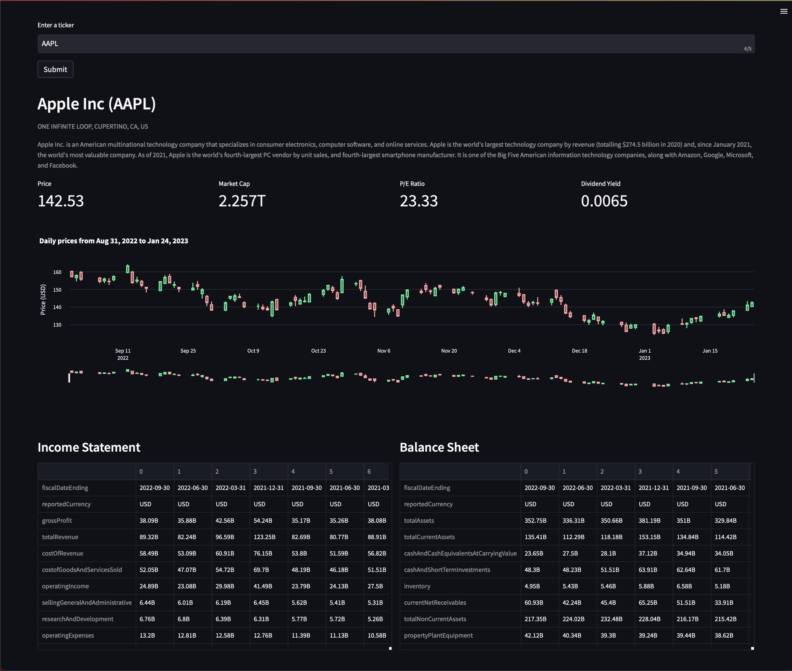

# Equity Analysis
<!-- UI Screenshot -->

---
## About
<!-- Description -->
This is a simple equity analysis tool that gives you an overview of any publicly traded company. It uses the [Alpha Vantage API](https://www.alphavantage.co/) to get the data and [Streamlit](https://streamlit.io/) to display it. It is a work in progress and I will be adding more features as I go along.

Currently, looking up a ticker (e.g.) will give you the following information:
- Company Name
- Company Description
- Basic Financials (Pirce, Market Cap, P/E Ratio, Dividend Yield)
- An interactive candlestick chart of the last 100 days of trading
- Quarterly Income Statements
- Quarterly Balance Sheets

---
### How to Run
<!-- How to run -->
A live demo can be [found here](TODO).

Alternatively, to run the project locally, follow the steps outlined below:

1. Clone the repo
2. Get an [API key from Alpha Vantage](https://www.alphavantage.co/support/#api-key)
3. Store it as an environment variable called `ALPHA_VANTAGE_KEY` in the `.env` file in the root directory of the project.
   1. To see what an example of the `.env` file should look like, refer to `.env.example`.
   2. If you already have the API token stored under a different name, you can simply change the name of the variable in `src/financials.py`
4. From the root directory of the project, run `pip install -r requirements.txt`
5. Run the app with `streamlit run src/app.py`
